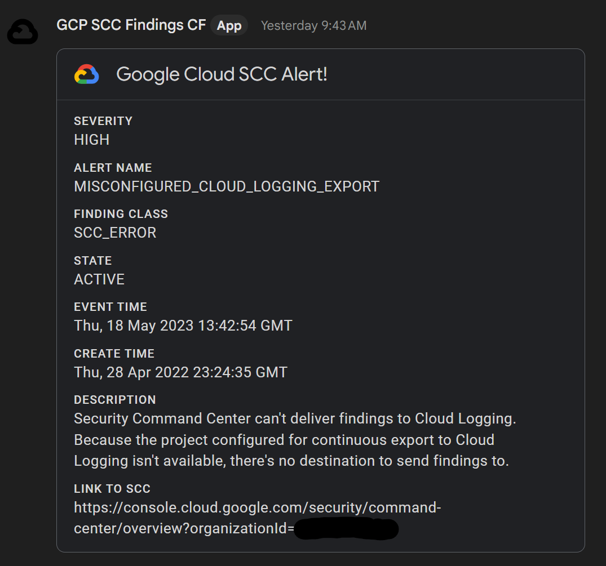

# Google Cloud SCC Notifications to Google Chat

This repository contains provides example code to create Finding Notifications for Security Command Center, and sends the findings to Google Chat using a Webhook.

The infrastructure is written in Terraform, which will create the following components:

- [SCC Finding Notifications](https://cloud.google.com/security-command-center/docs/how-to-notifications)
- [Pub/Sub Topic](https://cloud.google.com/pubsub)
- [GCS Bucket](https://cloud.google.com/storage/docs/creating-buckets)
- [GCS Object](https://cloud.google.com/storage/docs/json_api/v1/objects)
- [Cloud Function](https://cloud.google.com/functions)
- [Secrets Manager](https://cloud.google.com/secret-manager)

The Cloud Function is written in Node.js which will parse the Pub/Sub event and send the details to a Google Chat Webhook using the a Card message with the Google Chat API.


## Prerequisites 

1. Tested on Terraform v1.4.6 with Google Cloud Provider v4.64.0
2. Google Cloud SDK
3. Enable Cloud Functions, Cloud Build, Pub/Sub and Secrets Manager APIs.  
   - gcloud services enable cloudfunctions.googleapis.com
   - gcloud services enable cloudbuild.googleapis.com
   - gcloud services enable pubsub.googleapis.com
   - gcloud services enable secretmanager.googleapis.com
4. Enable Security Command Center (UI)
5. Node.js runtime >= 1.6
6. Create a Google Chat Webhook - info can be found [here](https://developers.google.com/chat/how-tos/webhooks#create_a_webhook)


## Usage

- Update the terraform.tfvars file with your ORG and PROJECT IDs then deploy using terraform.  
- You will be prompted to enter the Incoming webhook G-Chat URL from step #6 during TF Apply and Deploy.  
- This value will be stored in Secrets Manager.
```
bucket_name                     = "scc_gchat_notification_code"   
state_bucket_name               = "scc_gchat_notification_state"   
bucket_location                 = "US"
function_name                   = "scc-notification-gchat"
function_description            = "SCC Notifications to Google Chat"
function_runtime                = "nodejs16"
function_location               = "us-central1"
topic_name                      = "scc-notifications-topic-gchat"    
topic_iam_role                  = "roles/pubsub.publisher"
scc_notification_name           = "all-active-alerts-gchat"    
scc_notification_description    = "My Custom Cloud Security Command Center Finding Notification Configuration"
notification_filter             = "(severity=\"HIGH\" OR severity=\"CRITICAL\") AND state=\"ACTIVE\""
secret_id                       = "scc-gchat"
org_id                          = "CHANGE_ME"
project_id                      = "CHANGE_ME"
```

## Moving state to a GCS bucket

- Uncomment and Update the backend.tf file with the state bucket name given by the OUTPUT of the Terraform run. (If you cleared the TF output, you can get he value by running: terraform output)
- terraform init -migrate-state

## Moving state back to local

- Comment all of the content of the backend.tf file.
- terraform init -migrate-state

## Output Example



*Repo inspired by https://github.com/GoogleCloudPlatform/solutions-terraform-scc-notifications-gchat and not forked because of innactivity.*
