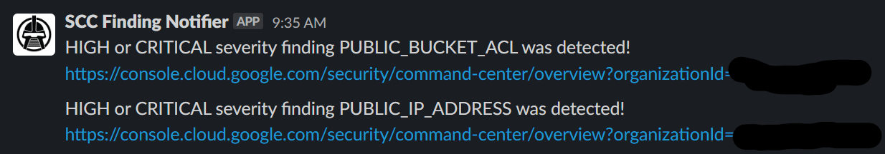

# Google Cloud SCC Notifications to Slack

This repository contains provides example code to create Finding Notifications for Security Command Center, and sends the findings to Slack via API call.

The infrastructure is written in Terraform, which will create the following components:

- [SCC Finding Notifications](https://cloud.google.com/security-command-center/docs/how-to-notifications)
- [Pub/Sub Topic](https://cloud.google.com/pubsub)
- [GCS Bucket](https://cloud.google.com/storage/docs/creating-buckets)
- [GCS Object](https://cloud.google.com/storage/docs/json_api/v1/objects)
- [Cloud Function](https://cloud.google.com/functions)
- [Secrets Manager](https://cloud.google.com/secret-manager)

The Cloud Function is written in Python which will parse the Pub/Sub event and send the details to the Slack API using the Slack App Bot Token for validation.

## Prerequisites 

1. Tested on Terraform v1.4.6 with Google Cloud Provider v4.64.0
2. Google Cloud SDK
3. Enable Cloud Functions, Cloud Build, Pub/Sub and Secrets Manager APIs.  
   - gcloud services enable cloudfunctions.googleapis.com
   - gcloud services enable cloudbuild.googleapis.com
   - gcloud services enable pubsub.googleapis.com
   - gcloud services enable secretmanager.googleapis.com
4. Enable Security Command Center (UI)
5. Python runtime = 3.8
6. Create a Slack Channel
7. Create a Slack API App - info can be found [here](https://cloud.google.com/security-command-center/docs/how-to-enable-real-time-notifications#setting_up_a_messaging_app) in the Slack section.


## Usage

- Update the terraform.tfvars file with your ORG, Project and Slack values then deploy using terraform.
- You will be prompted to enter the Slack Bot Token from step #7 during TF Apply and Deploy.  
- This value will be stored in Secrets Manager.

```
bucket_name                     = "scc_slack_notification_code"
bucket_location                 = "US"
function_name                   = "scc-notification-slack"
function_description            = "SCC Notifications to Slack"
function_runtime                = "python38"
function_location               = "us-central1"
topic_name                      = "scc-notifications-topic-slack"    
topic_iam_role                  = "roles/pubsub.publisher"
scc_notification_name           = "all-active-alerts-slack"    
scc_notification_description    = "My Custom Cloud Security Command Center Finding Notification Configuration"
notification_filter             = "(severity=\"HIGH\" OR severity=\"CRITICAL\") AND state=\"ACTIVE\""
secret_id                       = "scc-slack"
org_id                          = "CHANGE_ME"
project_id                      = "CHANGE_ME"
slack_channel                   = "CHANGE_ME"
```



*Python code coming from https://cloud.google.com/security-command-center/docs/how-to-enable-real-time-notifications#slack code snippet.*
